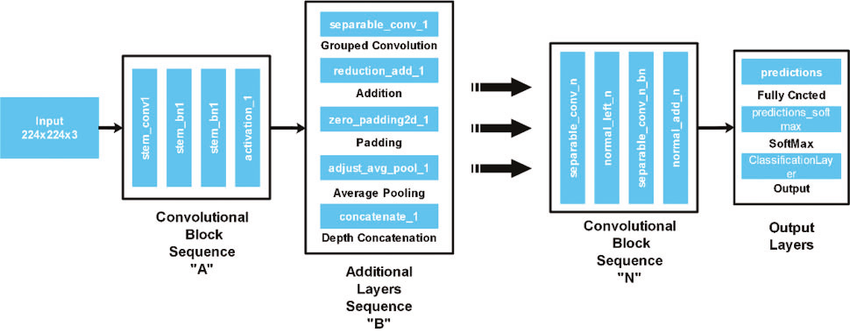

# TorchVisionRPS

## Description
This is a rock-paper-scissors game that uses computer vision to determine your move. You play against the computer, and choose your move by showing your move
to the camera inside the rectangle. The computer will then choose its move, and the winner will be displayed on the screen.

The game is built using PyTorch and OpenCV, and is trained on your own images that is collected when running the **train.py** file. There's 4 classes in the game:
1. Rock
2. Paper
3. Scissors
4. Nothing

The **Nothing** class is used to train the model to not make a prediction when there's no hand in the rectangle. This is to avoid the model making a prediction
when there's no hand in the rectangle.

## Architecture
The model uses a pretrained *MobileNetV2* model as the backbone, and is then trained on the images collected from the **train.py** file. The model is trained
using *SGD* as the optimizer, and *CrossEntropyLoss* as the loss function. The model is trained for a default of 15 epochs, but you can just give a different argument
when running the **train.py** file.

## How to use
1. Start by cloning the repository and installing the requirements
- ``git clone https://github.com/Tovborg/TorchVisionRPS.git``
- ``cd TorchVisionRPS``
- ``pip install -r requirements.txt``

2. Run the **train.py** file to collect images for training the model
- ARGUMENTS: ``--epochs`` (default=15), ``--batch_size`` (default=32), ``--lr`` (default=0.001), ``--n_samples`` (default=100), ``--n_collections`` (default=1)
- ``python train.py ``
- And then just follow the instruction in the OpenCV window
- The images will be saved in the **data** folder, with the class name as the folder name
- Note: Remember to click escape when you're done collecting images to start training the model
- Note: The more samples you collect, the better the model will be, and n-collections can help you collect samples in different locations and lighting

3. Run the **play.py** file to play the game
- ``python play.py``
- The game will prompt you to enter the number of rounds you want to play
- Then just follow the instructions in the OpenCV window

## Examples
### Training Example

### Playing Example

